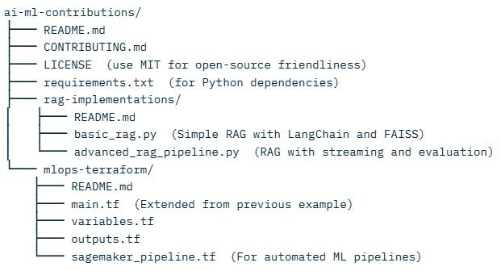

# Terraform-based-MLOps-pipelines
AI/ML projects, including RAG implementations and Terraform-based MLOps pipelines.

2. Folder Structure:

3. nstall Dependencies (for local testing):
In the repo root, create requirements.txt

Run pip install -r requirements.txt for Python parts.

4. Testing the Code:

For RAG: Run python rag-implementations/basic_rag.py (set your API keys).
For Terraform: cd mlops-terraform && terraform init && terraform plan.
Commit and push: git add . && git commit -m "Initial AI/ML contributions setup" && git push origin main.

5. Encouraging Contributions:

Add issues for "Good First Issue" like "Improve RAG evaluation metrics."
Use GitHub's fork/PR workflow in CONTRIBUTING.md.

# AI/ML Contributions: Hands-On Guide to Open-Source AI/ML Projects

Welcome to **ai-ml-contributions**! This repository is a hub for learning and contributing to AI/ML projects. It includes practical examples in **Retrieval-Augmented Generation (RAG)** for enhancing LLMs with external knowledge and **Terraform-based MLOps pipelines** for automating ML infrastructure on AWS.

## Why Contribute?
- AI/ML is booming—contribute to projects like LangChain, Hugging Face, or AWS SageMaker samples.
- Start small: Fork this repo, tweak examples, and submit PRs.
- Focus areas: RAG for better NLP apps, MLOps for scalable ML deployment.

## Quick Start
1. Clone: `git clone https://github.com/yourusername/ai-ml-contributions.git`
2. Install deps: `pip install -r requirements.txt`
3. Explore folders:
   - `/rag-implementations`: Build RAG systems with LangChain.
   - `/mlops-terraform`: Provision MLOps infra with Terraform.

## Examples
- **RAG**: Query a document corpus with vector search + LLM.
- **MLOps**: Auto-deploy SageMaker notebooks, buckets, and pipelines.

## Contributing
See [CONTRIBUTING.md](CONTRIBUTING.md) for how to submit PRs, report issues, or add new examples (e.g., GCP Vertex AI or PyTorch integrations).

## License
MIT License—fork freely!

## Related Projects
- [LangChain RAG Docs](https://python.langchain.com/docs/use_cases/question_answering/)
- [Terraform AWS SageMaker](https://registry.terraform.io/providers/hashicorp/aws/latest/docs/resources/sagemaker_notebook_instance)

